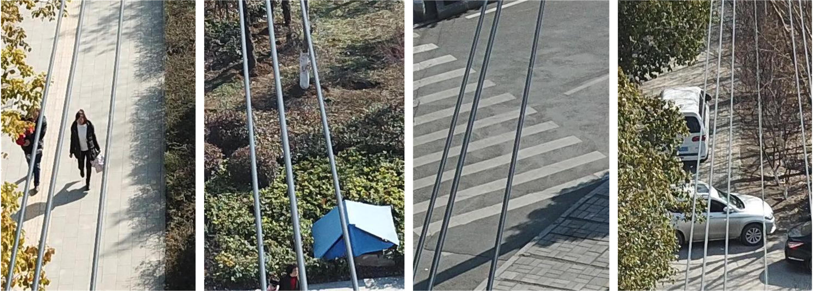
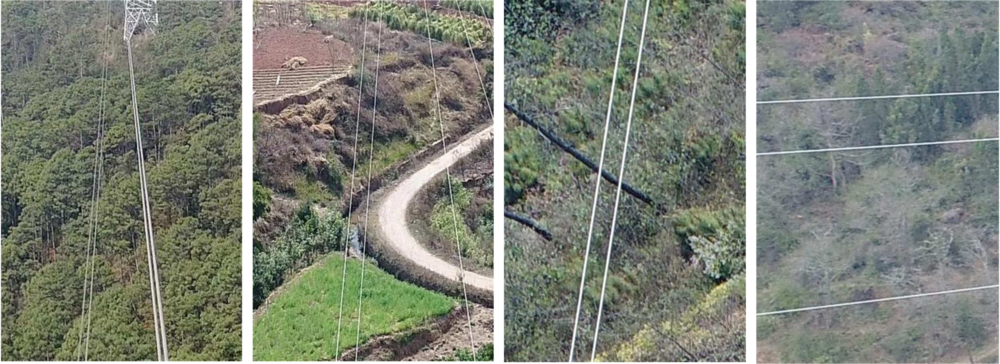

### About PLD-UAV
Power line detection plays an important role in an automated UAV-based electricity inspection system, which is crucial for real-time motion planning and navigation along power lines. Although previous approaches have achieved great improvements, they are mainly developed on top of several sample images or synthetic ones due to the lack of power line datasets, which may be inappropriate for learning-based methods. To overcome this, we introduce two power line detection datasets with pixel-wise annotations, power line dataset of urban scene (**PLDU**) and power line dataset of mountain scene (**PLDM**). The detailed information of the two datasets is listed below. These images contain complex backgrounds and power lines with different features. All images are manually annotated with boundary labels. Besides, standard data augmentation techniques, including rotation, flipping and resizing have been performed for optional use. We evaluate several state-of-the-art power line detection methods on the two datasets. Experimental results demonstrate that accurate power line detection on the two datasets is quite a challenging task. **PLDU and PLDM are publicly available, including the raw data and ground truth.** 

Dataset | Train | Test | Size | maxDist
------ | ------| ------| ------| ------
PLDU | 453 | 120 | 540X360 | 0.0075
PLDM | 237 | 50 | 540X360 | 0.0075

### PLDU
Here are some samples from PLDU. The dataset is available on [Google Drive](https://drive.google.com/open?id=1XjoWvHm2I8Y4RV_i9gEd93ZP-KryjJlm)

### PLDM
Here are some samples from PLDM. The dataset is available [Google Drive](https://drive.google.com/open?id=1bKFEuXKHRsy0tnOnoEVW6oRi7hS5oekr)

### Benchmark
For evaluation, we refer to the boundary detection benchmark developed in [BSDS500](https://www2.eecs.berkeley.edu/Research/Projects/CS/vision/grouping/resources.html) dataset.
The accuracy of power line detection is measured using four main criteria: F1-measure of optimal
dataset scale threshold (ODS), F1-measure of optimal image scale threshold (OIS), false positive rate and
precision-recall curve.
